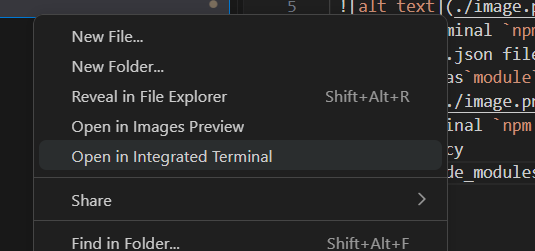

# NPM Project

create project folder
right click on project folder and select open integrated terminal
 
 type in terminal `npm init -y` press enter"
open package.json file from project folder
update type as`module` in package.json
