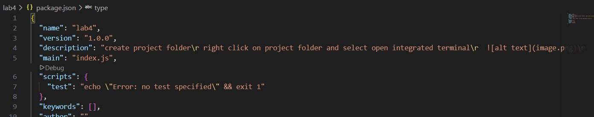
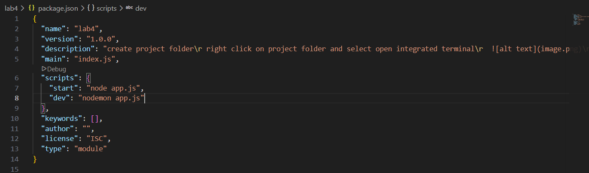

# NPM Project

create project folder
right click on project folder and select open integrated terminal
 
 type in terminal `npm init -y` press enter"
open package.json file from project folder
update type as`module` in package.json

type in terminal `npm i nodemon -D` to install nodemon, which restarts server while file changes. -D flag indicate install as dev dependency
it create node_modules folder and package-lock.json
update .gitignore file and write project-folder/node_module
update package.json to run the project, update script property as below

```
"scripts": {
    "start":"node app.js",
    "dev":"nodemon app.js"
},
```
now you can start the server by typing `npm run dev` in the terminal of project folder